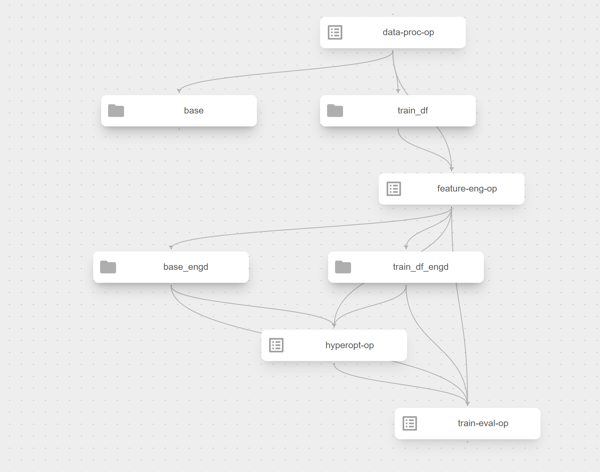

# kaggle_home_credit

I took part in this competition: https://www.kaggle.com/competitions/home-credit-credit-risk-model-stability
The purpose of this project was to present some EDA and model development performed for this proejct 
and to learn how to write machine learning pipelines with kfp and mlflow, using local k8s server on minikube.

## setup

The notebooks in the main folder contain experiments and analyses I performed during the cmopetition.  
pipeline-components folder contains production code, divided into folders with separate docker image per each pipeline compnent.  

I used the instructions from here: https://github.com/vinayak-shanawad/AI-ML-Projects/blob/main/ML-Pipeline-with-Kubeflow-MLflow-KServe/README.m
To setup a local minikube instance with mlflow, kfp and kserve

If you want to run the code locally, you need to install the dependencies from pyprojct.toml file.

```
pip install poetry
poetry init
```

But in order to run the pipeline locelly, it's enough to setup the cluster with kfp and mlflow, as explained in the link above,  
export the data to pipeline-components/kaggle_data

if you don't have kfp python library, run:
```
pip install kfp
```

while in pipeline-compnents, run:

```
python pipeline.py
```
This should create a pipeline.yaml file.  
And then create a new pipeline in kfp ui.

## data
I took the data from the competition: https://www.kaggle.com/competitions/home-credit-credit-risk-model-stability/data?select=parquet_files
To focus on the ML pipeline, I assumed irl the data would be stored in a database, and the entry to the pipeline would be group of parquet files extracted from that database.


